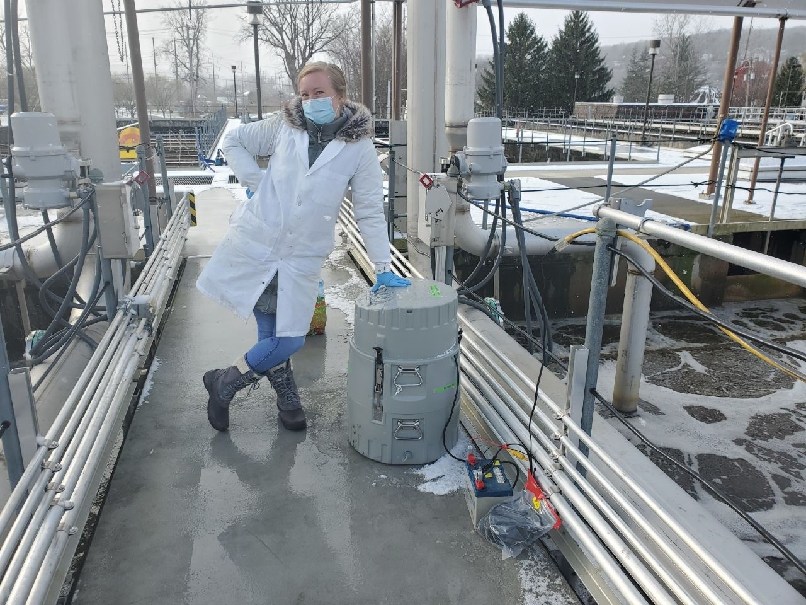

[[Home](https://stephlynrich.github.io)] | 
[[Publications](https://stephlynrich.github.io/publications.html)]
[[Projects](https://stephlynrich.github.io/projects.html)]

# About me
I am passionate about preserving environmental quality, improving process sustainability, and promoting green chemistry such as the design of environmentally benign pharmaceuticals. In August 2023, I will be completing my PhD on the biotransformation of anthropogenic organic pollutants in wastewater treatment systems. I have 4 years of experience using liquid chromatography coupled with high-resolution mass spectrometry, and I enjoy analyzing trends in data using R.

