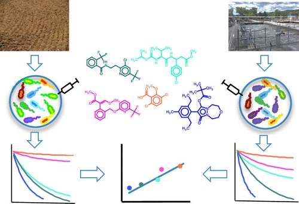

[[Home](https://stephlynrich.github.io)] | 
[[Publications](https://stephlynrich.github.io/publications.html)]
[[Projects](https://stephlynrich.github.io/projects.html)]
[[Twitter](https://twitter.com/stephrich257)]
[[LinkedIn](https://www.linkedin.com/in/stephanielrich/)]

## Temporally dynamic biotransformations in a full-scale WWTP

Despite decades of micropollutant (MP) monitoring at wastewater treatment plants (WWTPs), we lack a fundamental understanding of the time-varying metabolic processes driving MP biotransformations. To address this knowledge gap, we collected 24-h composite samples from the influent and effluent of the conventional activated sludge (CAS) process at a WWTP over 14 consecutive days. We used liquid chromatography and high-resolution mass spectrometry (LC-HRMS) to: (i) quantify 184 MPs in the influent and effluent of the CAS process; (ii) characterize temporal dynamics of MP removal and biotransformation rate constants; and (iii) discover biotransformations linked to temporally variable MP biotransformation rate constants. We measured 120 MPs in at least one sample and 66 MPs in every sample. There were 24 MPs exhibiting temporally variable removal throughout the sampling campaign. We used hierarchical clustering analysis to reveal four temporal trends in biotransformation rate constants and found MPs with specific structural features co-located in the four clusters. We screened our HRMS acquisitions for evidence of specific biotransformations linked to structural features among the 24 MPs. Our analyses reveal that alcohol oxidations, monohydroxylations at secondary or tertiary aliphatic carbons, dihydroxylations of vic-unsubstituted rings, and monohydroxylations at unsubstituted rings are biotransformations that exhibit variability on daily timescales.

## Rate-determining functional groups discovered using random forest

The goal of this research was to identify functional groups that determine rates of micropollutant (MP) biotransformations performed by wastewater microbial communities. To meet this goal, we performed a series of incubation experiments seeded with four independent wastewater microbial communities and spiked them with a mixture of 40 structurally diverse MPs. We collected samples over time and used high-resolution mass spectrometry to estimate biotransformation rate constants for each MP in each experiment and to propose structures of 46 biotransformation products. We then developed random forest models to classify the biotransformation rate constants based on the presence of specific functional groups or observed biotransformations. We extracted classification importance metrics from each random forest model and compared them across wastewater microbial communities. Our analysis revealed 30 functional groups that we define as either biotransformation promoters, biotransformation inhibitors, structural features that can be biotransformed based on uncharacterized features of the wastewater microbial community, or structural features that are not rate-determining. Our experimental data and analysis provide novel insights into MP biotransformations that can be used to more accurately predict MP biotransformations or to inform the design of new chemical products that may be more readily biodegradable during wastewater treatment.

## Read-across project

Compartment-specific degradation half-lives are essential pieces of information in the regulatory risk assessment of synthetic chemicals. However, their measurement according to regulatory testing guidelines is laborious and costly. Despite the obvious ecological and economic benefits of knowing environmental degradability as early as possible, its consideration in the early phases of rational chemical design is therefore challenging. Here, we explore the possibility to use half-lives determined in highly time- and work-efficient biotransformation experiments with activated sludge and mixtures of chemicals to predict soil half-lives from regulatory simulation studies. We experimentally determined half-lives for 52 structurally diverse agrochemical active ingredients in batch reactors with three concentrations of the same activated sludge. We then developed bi- and multivariate models for predicting half-lives in soil by regressing the experimentally determined half-lives in activated sludge against average soil half-lives of the same chemicals extracted from regulatory data. The models differed in how we accounted for sorption-related bioavailability differences in soil and activated sludge. The best-performing models exhibited good coefficients of determination (R2 of around 0.8) and low average errors (&lt; factor of 3 in half-life predictions) and were robust in cross-validation. From a practical perspective, these results suggest that it may indeed be possible to read across from half-lives determined in highly efficient biotransformation experiments in activated sludge to soil half-lives, which are obtained from much more work- and resource-intense regulatory studies, and that these predictions are clearly superior to predictions based on the output of BIOWIN, a publicly available quantitative structure-biodegradation relationship (QSBR) model. From a theoretical perspective, these results suggest that soil and activated sludge microbial communities, although certainly different in terms of taxonomic composition, may be functionally similar with respect to the enzymatic transformation of environmentally relevant concentrations of a diverse range of chemical compounds.
