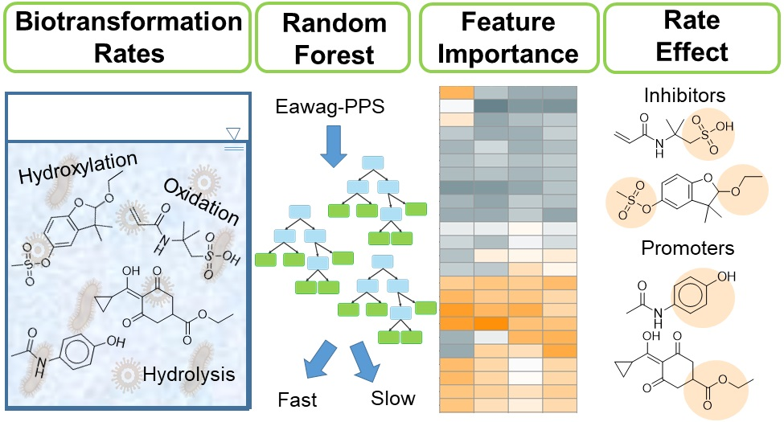

[[Home](https://stephlynrich.github.io)] | 
[[Publications](https://stephlynrich.github.io/publications.html)]
[[Projects](https://stephlynrich.github.io/projects.html)]

## Temporally dynamic biotransformations in a full-scale WWTP

## Rate-determining functional groups discovered using random forest

